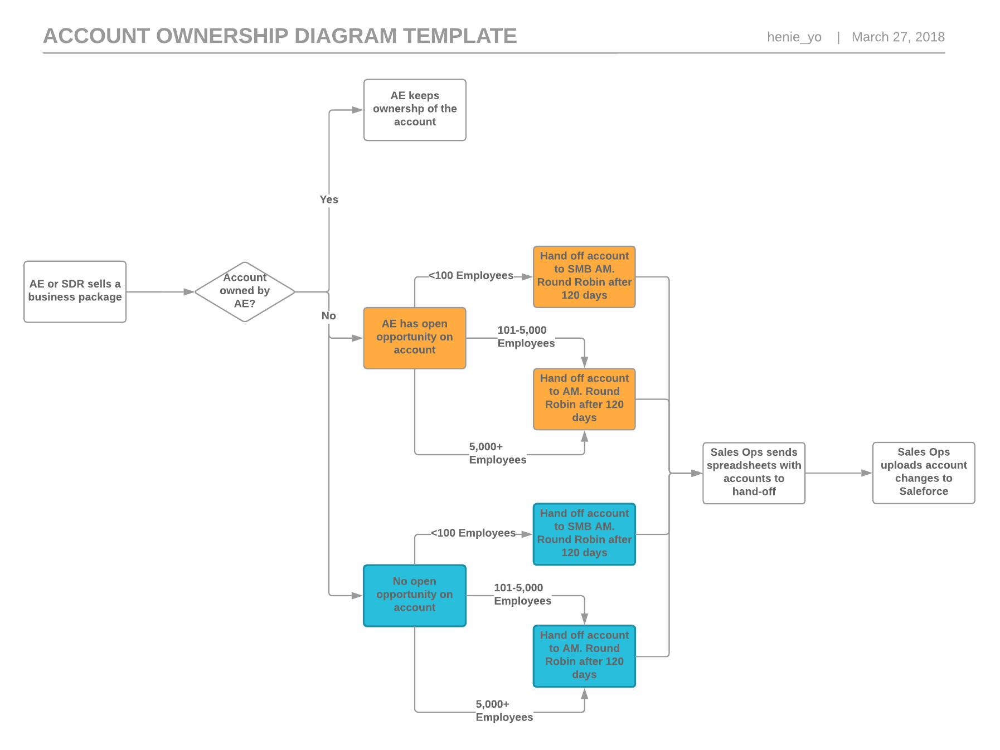

# SCOREKEEPER
### Instrucciones o descripcion:
Imagina que estás jugando un juego con algunas amigas y quieres ir registrando el puntaje de cada una. Crea un object llamado scores donde los keys o propiedades son los nombres de tus amigas, y los valores serán los puntajes (todos empiezan con 0).

Escribe una función que toma dos argumentos, el nombre de tu amiga y la cantidad de puntos nuevos que ha obtenido, y que actualice los puntos de la jugadora en el object scores. También escribe una función que imprima en la consola el total de los puntos.
## Pseudocodigo
### descripcion

En esta parte se describe la funcionalidad del proyecto descrito en pasos.
1. Definir el objeto `SCORES` en el cual se almacenaran toda la data.
2. Crear los elemento `JUGADORES` que se almacenaran como *keys* en el objeto SCORES.
3. Agregar el puntaje de cada jugador.
4. imprimimr toda la data que se encuentra almacenada en el objeto _SCORE_

